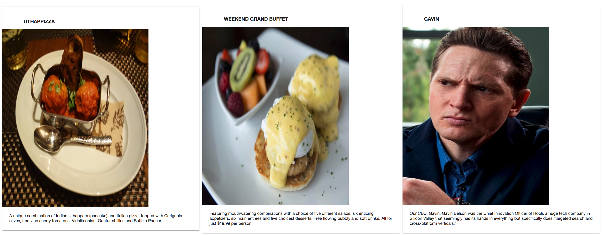
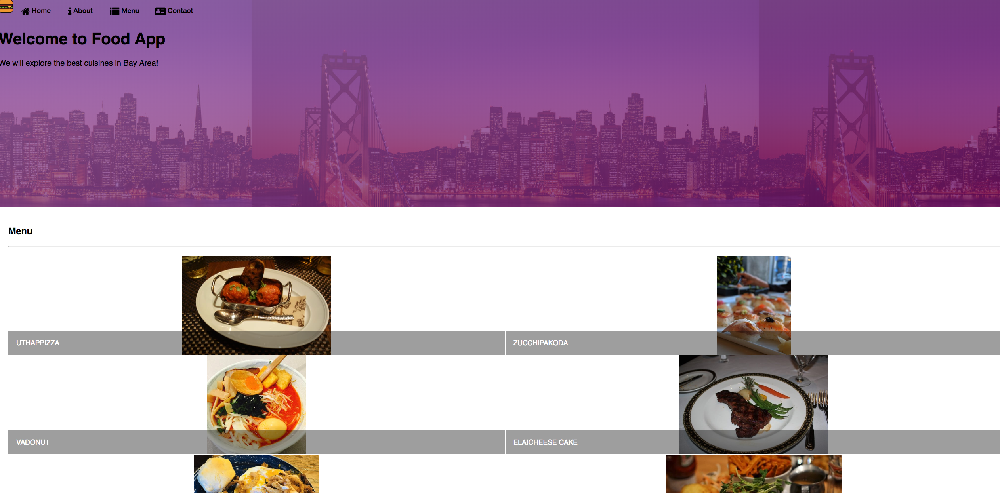
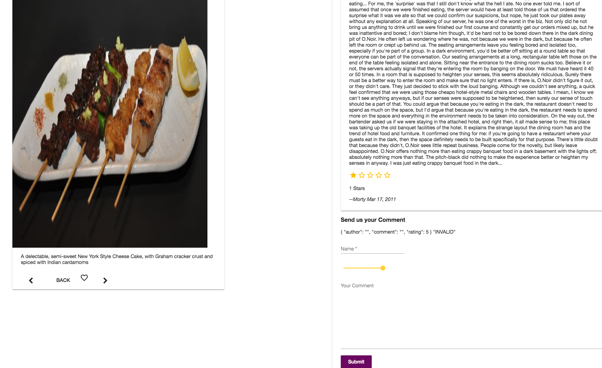
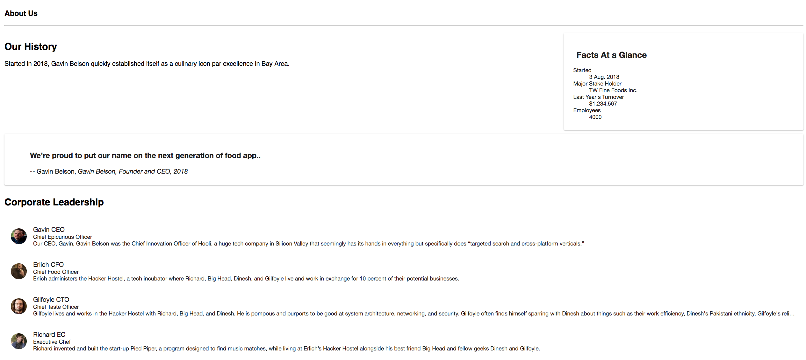

# AngularFoodApp
This project was generated with [Angular CLI](https://github.com/angular/angular-cli) version 6.1.1.

## Development server
Run `json-server --watch db.json -d 1000` to launch json server to get data
Run `ng serve` for a dev server. Navigate to `http://localhost:4200/`. The app will automatically reload if you change any of the source files.
-- $ng serve --open

## Build
Run `ng build` to build the project. The build artifacts will be stored in the `dist/` directory. Use the `--prod` flag for a production build.
Copy the contents of the dist folder to the public folder of your json-server.
Then run `json-server --watch db.json -d 1000` in json-server folder.
Now your Angular application can be accessed at the link http://localhost:3000/.
# Demo

### Home

### Menu

### Dish

### AboutMe

